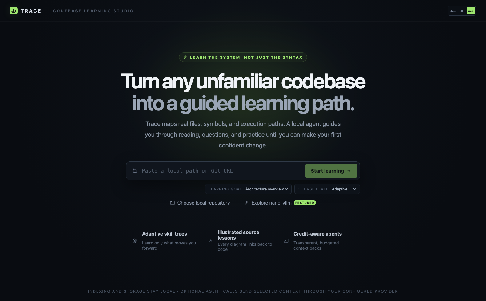
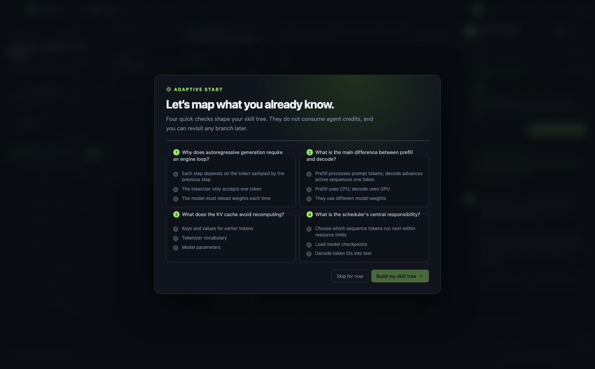
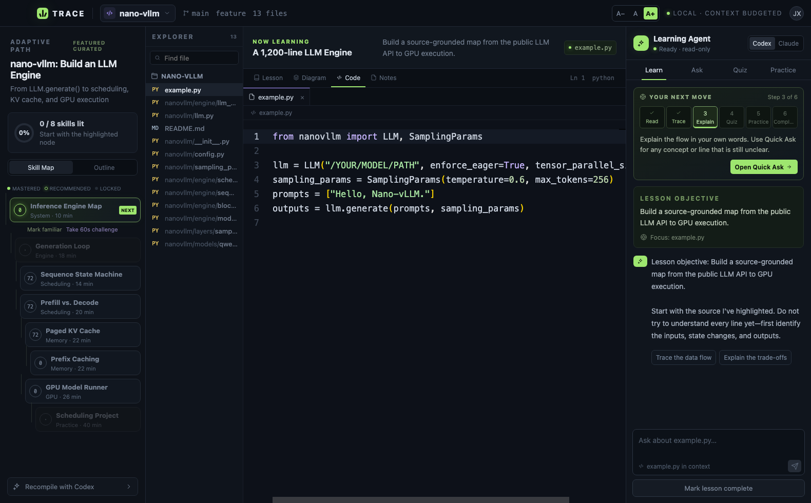
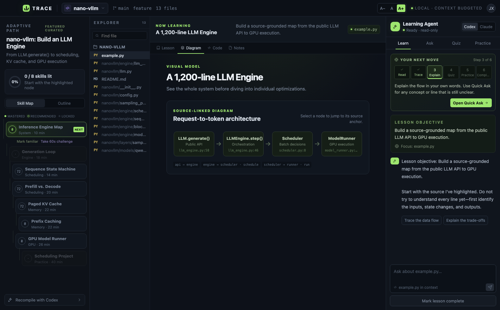
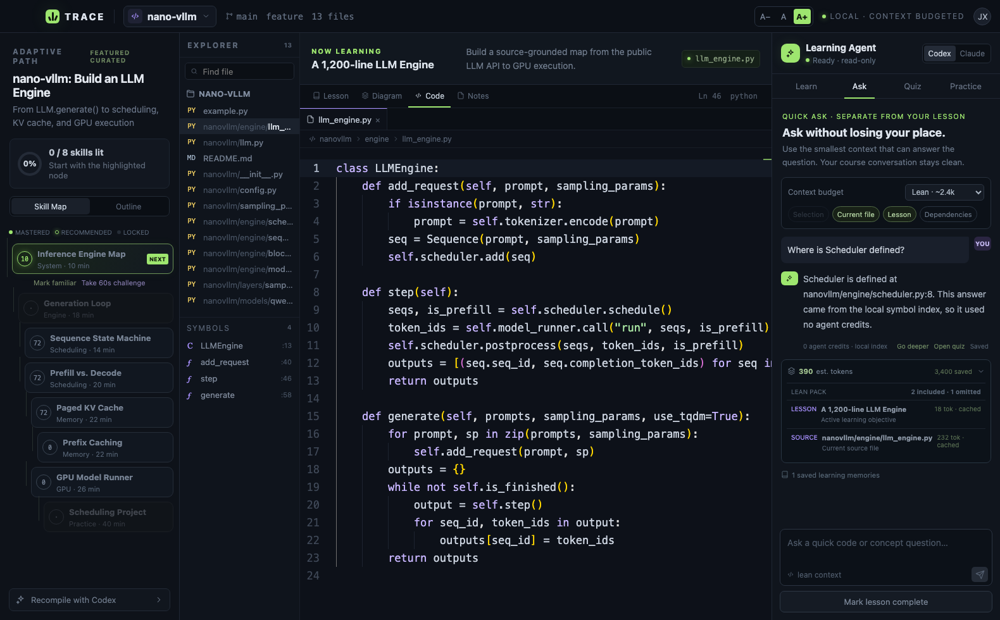
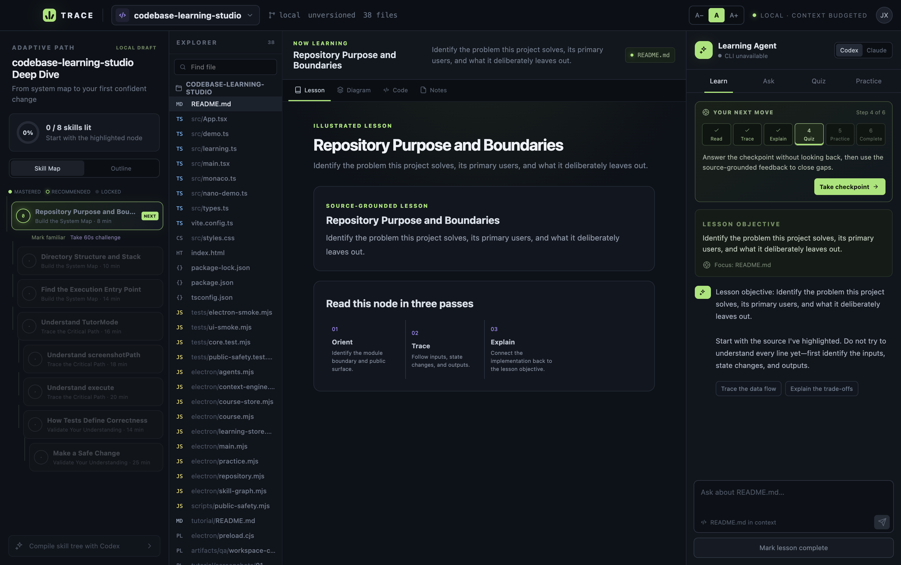

# Trace Tutorial

This tutorial walks through the complete Trace learning loop: open a repository, map what you already know, follow an adaptive skill tree, read source-linked lessons, ask focused questions, and prove understanding with quizzes and practice.

## 1. Start Trace

From the project directory:

```bash
npm install
npm run dev
```

Trace automatically detects local `codex` and `claude` CLIs. They are optional: repository indexing, local storage, diagnostics, the featured course, and local symbol lookup work without either agent. When you explicitly invoke an agent, Trace sends only the selected context pack through your configured provider and keeps the agent action read-only.

Use the text controls in the upper-right corner at any time:

- **A−** — Compact
- **A** — Comfortable, the default
- **A+** — Large

The choice applies to the entire interface and the Monaco code editor, and it is remembered the next time you open Trace.



## 2. Choose what to learn

There are three ways to begin:

1. Select **Explore nano-vllm** for the zero-setup featured course.
2. Paste an absolute local repository path.
3. Paste a remote Git URL and let Trace create a local learning copy.

Before starting, choose a learning goal:

- **Architecture overview** — understand components and boundaries.
- **Critical call paths** — follow the main execution flow.
- **Prepare to contribute** — prioritize tests, change surfaces, and practice.
- **Code review** — emphasize design trade-offs and correctness.

Choose Foundation, Adaptive, or Advanced for the initial course depth. The route can continue adapting after the course is created.

## 3. Map what you already know

Trace starts with four short diagnostic questions. This costs zero agent credits. The answers add evidence to the relevant skills, so familiar concepts do not have to block the learning path.

Select **Build my skill tree** when finished. Use **Skip for now** if you would rather begin from the foundations.



## 4. Read the skill tree

The left panel is a dependency-aware learning map:

- A glowing **NEXT** node is the recommended skill.
- Available nodes can be explored immediately.
- Locked nodes show concepts that depend on earlier skills.
- Mastered nodes contain enough learning evidence.
- Stale nodes point to learned source that has changed since it was studied.

Select **Mark familiar** to add self-reported evidence, or **Take 60s challenge** to verify the skill with a checkpoint. The **Outline** view provides a conventional module-and-lesson list when that is easier to scan.

## 5. Follow “Your Next Move”

The guide in the right panel always tells you what to do next:

1. **Read** — build a mental model from the illustrated lesson.
2. **Trace** — follow inputs, state changes, and outputs in source.
3. **Explain** — explain the flow yourself and ask about any gap.
4. **Quiz** — recall the idea without looking back.
5. **Practice** — make and inspect one safe, isolated change.
6. **Complete** — finish the lesson and unlock the next skill.

Use the green action button rather than guessing where to navigate. The guide advances from questions, quiz evidence, validated practice, and lesson completion. It can also be collapsed when you no longer need it.



## 6. Move between lesson, diagram, and source

The middle workspace has four views:

- **Lesson** explains the concept and why it matters.
- **Diagram** shows architecture or execution order.
- **Code** opens the real file and source line in Monaco.
- **Notes** stores private notes for this repository and lesson.

Diagram nodes and timeline steps are source-linked. Select one to jump directly to its implementation. In Code view, use the lesson-focused explorer or symbol list to move between related files and functions.

Read horizontally first: entry point → control flow → state change → output. Avoid trying to understand every class vertically on the first pass.



## 7. Use Learn and Quick Ask differently

The right panel separates two kinds of conversation:

- **Learn** keeps the guided lesson conversation.
- **Ask** handles quick code and concept questions without changing your place in the lesson.

For Quick Ask, select the smallest context that can answer the question:

- **Selection** — only the highlighted code.
- **Current file** — the active source file.
- **Lesson** — the objective and source anchors.
- **Dependencies** — related symbols and files.

Choose a context budget:

- **Lean** for definitions, locations, and focused questions.
- **Balanced** for multi-function reasoning.
- **Deep** only for cross-module analysis.

Definitions, file counts, entry points, and symbol locations may be answered from the local index with zero agent credits. Expand the context card beneath an answer to inspect included sections, reasons, estimated tokens, omitted context, cache hits, and estimated savings.

Use **Save to memory** for insights the tutor should remember later. Use **Go deeper** only when the focused answer is insufficient.



## 8. Take the quiz

Open **Quiz** when the guide reaches the checkpoint.

1. Answer in your own words without reopening the lesson.
2. Use **Show hint** only if needed.
3. Submit the answer for source-grounded feedback.

Quiz submission becomes learning evidence. It is not necessary to write a perfect answer; the goal is to reveal the next gap precisely.

## 9. Practice safely

Open **Practice** and describe the expected behavior and smallest reasonable change.

Select **Create isolated practice workspace** to create a Git worktree. The original repository remains untouched. From the practice card you can:

- Open the workspace in Finder.
- Inspect the current diff.
- Validate whether the diff is clean enough to count as practice evidence.
- End the session, with confirmation before discarding uncommitted work.

For a smaller exercise, select **Start guided practice**. The agent gives only the first step and remains read-only.

## 10. Complete and continue

Mark the lesson complete after you can:

- Explain the main flow without reading every line.
- Name the important state transition or design trade-off.
- Predict which files would change for a small requirement.

The skill tree recalculates mastery and highlights the next available node. If a later repository version changes a file used by a mastered lesson, only the affected skills become stale; unrelated changes preserve progress.

## 11. Let Trace study itself

Run the production Electron test with no repository override to let Trace index its own codebase, create a source-grounded starter curriculum, and answer basic symbol-location questions with zero agent credits:

```bash
npm run test:electron
```

To exercise the bridge against another repository, provide any absolute local path explicitly:

```bash
TRACE_ELECTRON_REPO=/path/to/repository npm run test:electron
```



## A credit-efficient learning recipe

For most lessons, use this sequence:

1. Read the illustrated lesson without an agent call.
2. Open one source anchor and trace it yourself.
3. Ask location and definition questions in Lean mode.
4. Add the current file only when the symbol index is insufficient.
5. Move to Balanced for a call path across several functions.
6. Use Deep only after identifying the exact cross-module question.
7. Save a durable answer to memory instead of asking it again.

Course compilation with Codex or Claude is intentionally opt-in. The local starter course and featured nano-vllm course are available before spending any agent credits.

## Verify the project

```bash
npm run build
npm test
npm run test:ui
npm run test:electron
npm audit
```

Return to the [main README](../README.md) for architecture and development notes.
